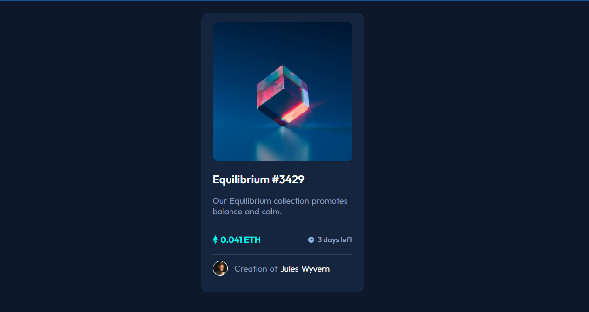

# Frontend Mentor - NFT preview card component solution

This is a solution to the [NFT preview card component challenge on Frontend Mentor](https://www.frontendmentor.io/challenges/nft-preview-card-component-SbdUL_w0U). Frontend Mentor challenges help you improve your coding skills by building realistic projects. 

## Table of contents

- [Overview](#overview)
  - [The challenge](#the-challenge)
  - [Screenshot](#screenshot)
  - [Links](#links)
- [My process](#my-process)
  - [Built with](#built-with)
  - [What I learned](#what-i-learned)
  - [Continued development](#continued-development)
  - [Useful resources](#useful-resources)
- [Author](#author)
- [Acknowledgments](#acknowledgments)

## Overview

### The challenge

Users should be able to:

- View the optimal layout depending on their device's screen size
- See hover states for interactive elements

### Screenshot



### Links

- Solution URL: [Add solution URL here](https://github.com/wasswaenockmale/frontendmentor_challenges/tree/master/nft-preview-card-component-main)
- Live Site URL: [Add live site URL here](https://nft-preview-card-component-delta-sandy.vercel.app/)

## My process

### Built with

- Semantic HTML5 markup
- CSS custom properties
- Flexbox

### What I learned

I learned more about the flex-box, box-shadow property of CSS and how to use the other custom properties of CSS.

To see how you can add code snippets, see below:

```html
<div class="container">Some HTML code I'm proud of</div>
```
```css
.container {
  box-shadow: 0px 2px 10px hsl(217, 54%, 11%);
}
```

### Continued development
I am learning more about the CSS properties and how to apply them to make good designs.


### Useful resources

- [Example resource 1](https://css-tricks.com/almanac/properties/b/box-shadow/) - This site helped to learn more about box-shadow and how it can be applied in css.

## Author

- Frontend Mentor - [@wasswaenockmale](https://www.frontendmentor.io/profile/wasswaenockmale)
- Twitter - [@wasswaenockmale](https://www.twitter.com/yourusername)


## Acknowledgments

I would like to thank my friends who I alway practice with for the time they give in for me to practice my frontend skills. 
