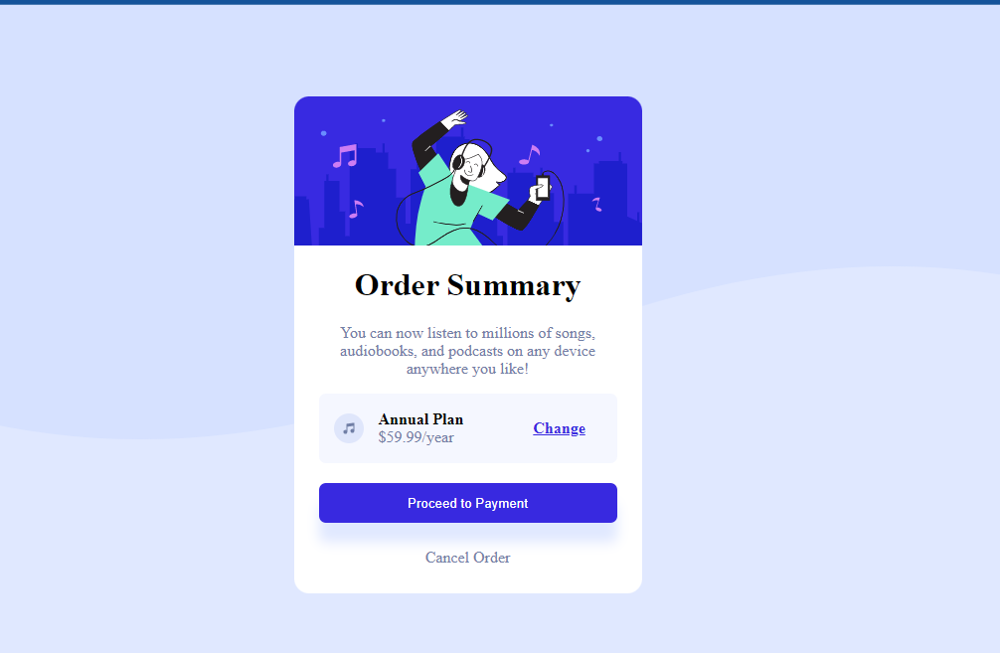

# Frontend Mentor - Order summary card solution

This is a solution to the [Order summary card challenge on Frontend Mentor](https://www.frontendmentor.io/challenges/order-summary-component-QlPmajDUj). Frontend Mentor challenges help you improve your coding skills by building realistic projects. 

## Table of contents

- [Overview](#overview)
  - [The challenge](#the-challenge)
  - [Screenshot](#screenshot)
  - [Links](#links)
- [My process](#my-process)
  - [Built with](#built-with)
  - [What I learned](#what-i-learned)
  - [Continued development](#continued-development)
- [Author](#author)
- [Acknowledgments](#acknowledgments)

## Overview

### The challenge

Users should be able to:

- See hover states for interactive elements

### Screenshot

### Links

- Solution URL: [Github link](https://github.com/wasswaenockmale/frontendmentor_challenges/tree/master/order-summary-component-main)
- Live Site URL: [vercel.app link](https://order-summary-component-main-six-theta.vercel.app/)

## My process

### Built with

- Semantic HTML5 markup
- CSS custom properties
- Flexbox

### What I learned

How to use the different background properties to style your background the way you want it.

### Continued development

CSS Grid, background styling, Flexbox, animations and transition

## Author

- Frontend Mentor - [@wasswaenockmale](https://www.frontendmentor.io/profile/wasswaenockmale)
- Twitter - [@wasswaenockmale](https://www.twitter.com/wasswaenockmale)

## Acknowledgments

Friends and Family for always supportting me in my journey to becoming a Full Stack developer.
