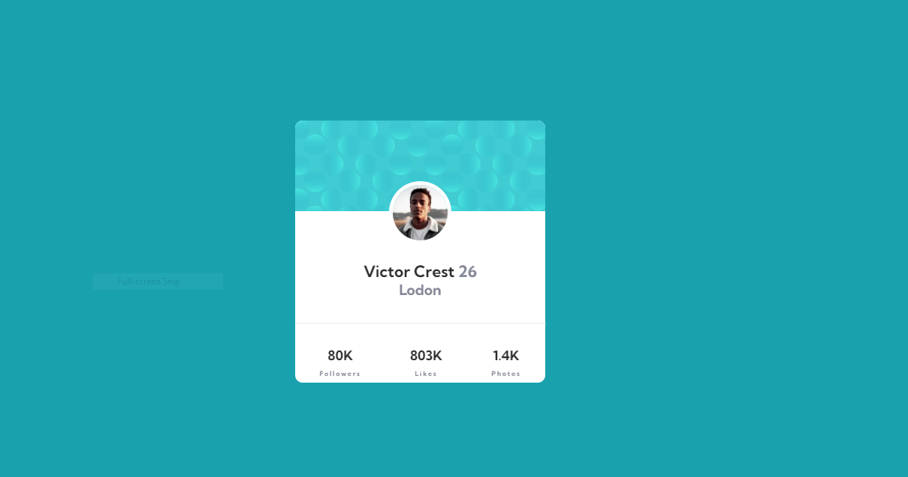

# Frontend Mentor - Profile card component solution

This is a solution to the [Profile card component challenge on Frontend Mentor](https://www.frontendmentor.io/challenges/profile-card-component-cfArpWshJ). Frontend Mentor challenges help you improve your coding skills by building realistic projects. 

## Table of contents

- [Overview](#overview)
  - [The challenge](#the-challenge)
  - [Screenshot](#screenshot)
  - [Links](#links)
- [My process](#my-process)
  - [Built with](#built-with)
  - [What I learned](#what-i-learned)
  - [Continued development](#continued-development)
- [Author](#author)
- [Acknowledgments](#acknowledgments)

## Overview

### The challenge

- Build out the project to the designs provided

### Screenshot

### Links

- Solution URL: [Add solution URL here](https://github.com/wasswaenockmale/frontendmentor_challenges/tree/master/profile-card-component-main)
- Live Site URL: [Add live site URL here](https://your-live-site-url.com)

## My process

### Built with

- Semantic HTML5 markup
- CSS custom properties
- Flexbox

### What I learned

I have learned how to use the negative margin to make a section overlap some other section. This project also helped me dive into learning how to use the z-index and position properties in CSS.

### Continued development

I want to continue learning about how to use the z-index and position properties to be able to overlap elements of html.
I also want to learn how I can possibly always make my frontend responsive.

## Author

- Frontend Mentor - [@wasswaenockmale](https://www.frontendmentor.io/profile/wasswaenockmale)
- Twitter - [@wasswaenockmale](https://www.twitter.com/wasswaenockmale)

## Acknowledgments

I would like to thank the Ablestate fraternity for the great help they are giving me through this journey. I would also like to thank Kevin Ketty Nakayiza for the CSS knowledge that she gives me.
